# DocsReader

The human window into an agent-managed markdown corpus. Your AI agents write docs, memory, and tasks through the bundled MCP server; you read the same plain markdown files in a clean native app. And it still works as a fast reader for any folder of markdown - macOS, Linux, Windows.

[](https://github.com/anbturki/docsreader/releases/latest)
[](https://github.com/anbturki/docsreader/releases)
[](https://github.com/anbturki/docsreader/actions/workflows/notarize-staple.yml)
[](https://github.com/anbturki/docsreader/actions/workflows/notarize-staple.yml)

[](https://github.com/anbturki/docsreader/releases/latest/download/DocsReader_0.7.0_universal.dmg)
[](https://github.com/anbturki/docsreader/releases/latest/download/DocsReader_0.7.0_x64-setup.exe)
[](https://github.com/anbturki/docsreader/releases/latest/download/DocsReader_0.7.0_amd64.AppImage)

Linux AppImage works on most distros; for `.deb` or `.rpm` see [Releases](https://github.com/anbturki/docsreader/releases/latest). Or install via [Homebrew or one-liner](#install).

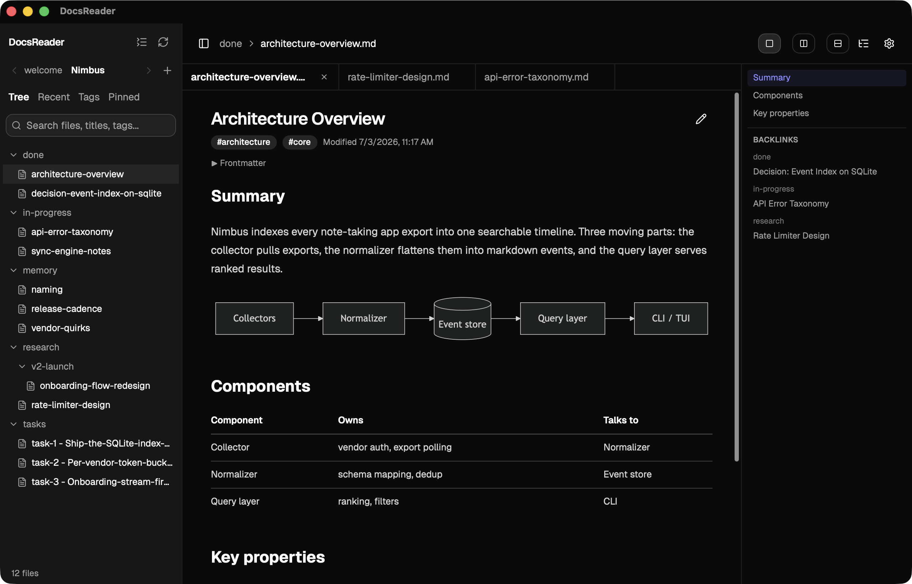

## How it works

Everything is plain markdown on disk - no database, greppable, versionable with git. A **workspace** is a folder of markdown (your default `~/notes`, or a project's `<project>/notes`) with three namespaces:

| Namespace | Lives in | Holds |
| --- | --- | --- |
| **Docs** | `research/` `in-progress/` `done/` `archived/` | Research, plans, decisions. The folder IS the status - moving the file IS the status change. Phase subfolders (`research/v2-launch/`) group work. |
| **Memory** | `memory/` | Short topic-addressed facts, one entry per topic, rewritten wholesale. |
| **Tasks** | `tasks/` | [Backlog.md](https://github.com/MrLesk/Backlog.md)-shaped files: `task-N` ids, status in frontmatter, an acceptance-criteria checklist. |

Agents write through the MCP server (`write_doc`, `search_docs`, `set_status`, `write_memory`, `write_task`, ...); open docs reload live as they write. A `docsreader://onboarding` resource teaches agents the model, and tool errors carry recovery hints so they self-correct instead of stalling.

## Connect your AI agents

In DocsReader, **Settings → AI agents → Connect** detects installed clients (Claude Code, Cursor, Windsurf, VS Code, Codex) and registers the bundled `docsreader-mcp` with each in one click, user-wide.

To register manually, point any stdio MCP client at the binary - there is no URL, each client spawns it:

| Client | Command |
| --- | --- |
| Claude Code | `claude mcp add --scope user docsreader -- docsreader-mcp` |
| Codex CLI | `codex mcp add docsreader -- docsreader-mcp` |
| VS Code | `code --add-mcp '{"name":"docsreader","command":"docsreader-mcp"}'` |
| Cursor / Windsurf | add `{ "docsreader": { "command": "docsreader-mcp" } }` under `mcpServers` in the client's MCP config |

If `docsreader-mcp` is not on your PATH, use the full binary path instead:

| Install | Binary location |
| --- | --- |
| Homebrew (macOS) | `docsreader-mcp` (on PATH) |
| DMG (macOS) | `/Applications/DocsReader.app/Contents/MacOS/docsreader-mcp` |
| deb (Linux) | `/usr/bin/docsreader-mcp` (on PATH) |
| Windows | `docsreader-mcp.exe` next to `DocsReader.exe` |

Homebrew users from before v0.6.0: run `brew upgrade --cask docsreader` once so the binary links onto PATH. Then copy the [AGENTS template](docs/AGENTS-TEMPLATE.md) into your repo's `AGENTS.md` or `CLAUDE.md`.

## MCP tools

Agents drive the workspace through the MCP server. Every tool takes an optional `workspace` slug; errors carry recovery hints so agents self-correct.

| Group | Tools |
| --- | --- |
| Workspaces | `list_workspaces` · `init_workspace` · `ping` |
| Docs | `write_doc` · `read_doc` · `list_docs` · `search_docs` · `update_doc` · `set_status` · `set_phase` · `archive` · `rename_doc` · `delete_doc` |
| Memory | `write_memory` · `search_memory` |
| Tasks | `write_task` · `list_tasks` · `set_task_status` · `update_task` |

For example, capturing a decision and the work it implies:

```jsonc
write_doc       { "title": "Use Postgres", "status": "done", "body": "..." }
write_task      { "title": "Add connection pooling",
                  "acceptance_criteria": ["Bounded pool", "Clean 503 on timeout"] }
set_task_status { "id": "task-1", "status": "In Progress" }
```

Full reference - every tool, its parameters, and the `docsreader://` resources - in [docs/MCP.md](docs/MCP.md).

## Claude Code plugin

If you use Claude Code, the bundled plugin surfaces DocsReader tasks in the terminal:

```shell
/plugin marketplace add anbturki/docsreader
/plugin install docsreader@docsreader
```

| Surface | What it does |
| --- | --- |
| `/docsreader:board` | Print the To Do / In Progress / Done board on demand |
| `/docsreader:sync` | Pull fresh task state into context |
| Statusline | Live `To Do / In Progress / Done` count (one-time setup) |
| Auto-sync hook | Hands the assistant updated counts after a status change via the MCP |

Registers the same `docsreader-mcp` server, so it needs `docsreader-mcp` on your PATH and `jq`. Full setup in the [plugin README](plugins/docsreader/README.md).

## Features

| Feature | |
| --- | --- |
| **Rich rendering** | GitHub-flavored Markdown, KaTeX math, Mermaid diagrams, and Shiki code highlighting across twelve themes |
| **Interactive checklists** | Toggle any checkbox from the rendered view; the change writes back to the file |
| **Five lenses** | Tree, Recent, Tags, Pinned, and a Tasks kanban board over one library |
| **Split view** | Two docs side-by-side or stacked, each with its own tabs and scroll |
| **Task board** | To Do / In Progress / Done with drag-to-advance and acceptance-criteria progress, consistent with the MCP |
| **Agent-aware** | Open docs reload live as agents write; on-disk changes surface a diff; git status shows in the tree |
| **Quiet and local** | Minimal chrome, no telemetry, signed updates, notarized on macOS |

Full list in [docs/FEATURES.md](docs/FEATURES.md). Found a bug or want a feature? [Open an issue](https://github.com/anbturki/docsreader/issues/new).

## What's new in v0.7.0

| Change | |
| --- | --- |
| **Task board** | A Tasks lens with a kanban, drag-to-advance through the same core agents use, and filters by title, priority, and label |
| **Task headers** | Task docs render a status pill, priority, assignee, and an acceptance-criteria progress bar |
| **Interactive checklists** | Toggle checkboxes from the rendered view; the change writes back and moves task progress with it |
| **Refreshed UI** | An integrated overlay toolbar, a draggable window, and design tokens across settings and the board |
| **Claude Code plugin** | Board and sync skills, a live task statusline, and a task-sync hook |

Full history on the [releases page](https://github.com/anbturki/docsreader/releases).

## Screenshots

| | |
| --- | --- |
| 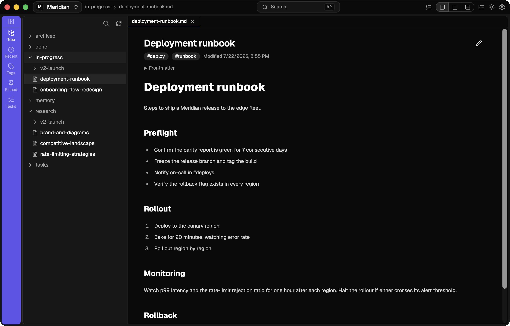 | 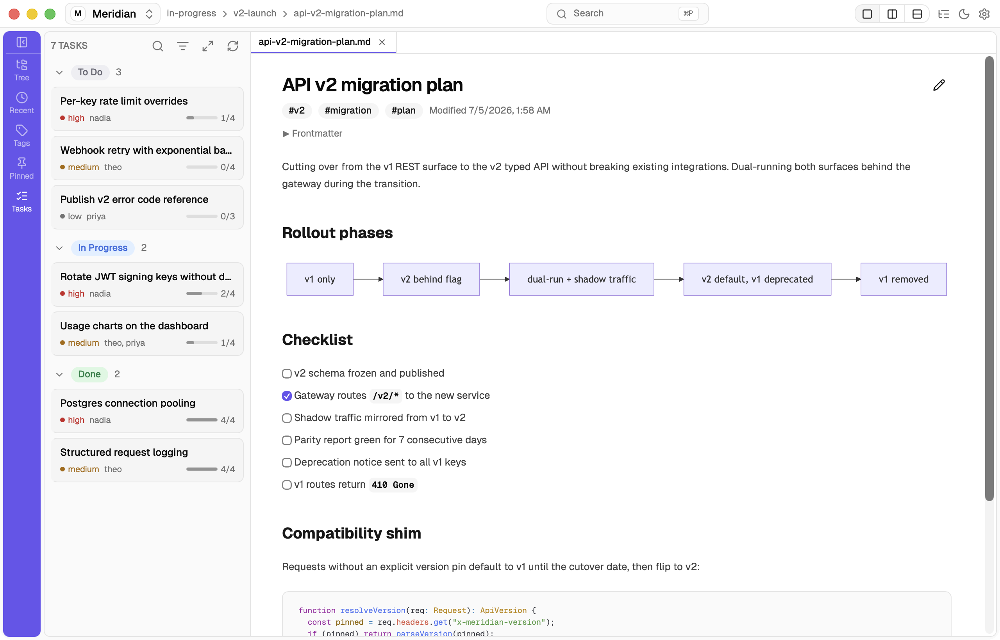 |
| 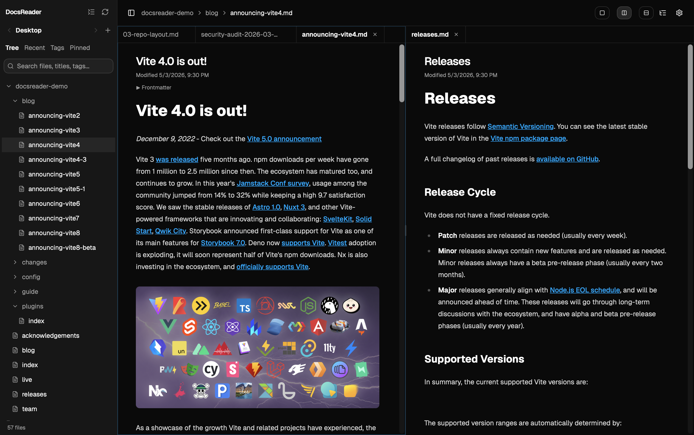 | 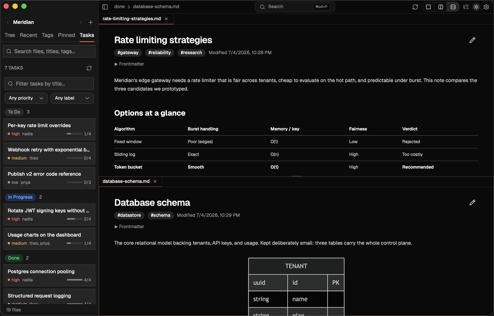 |
| 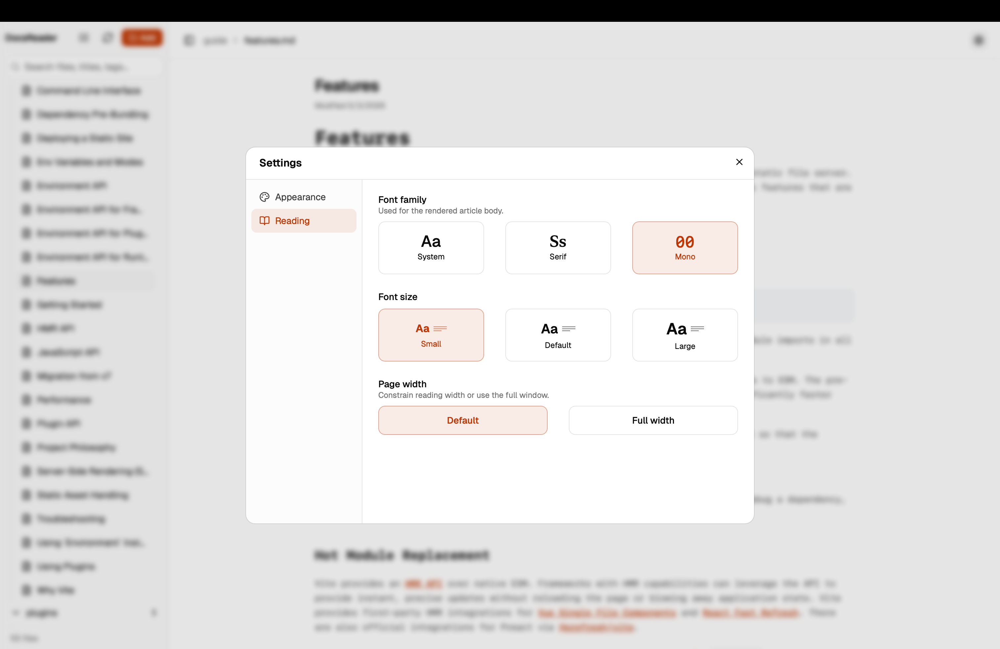 | 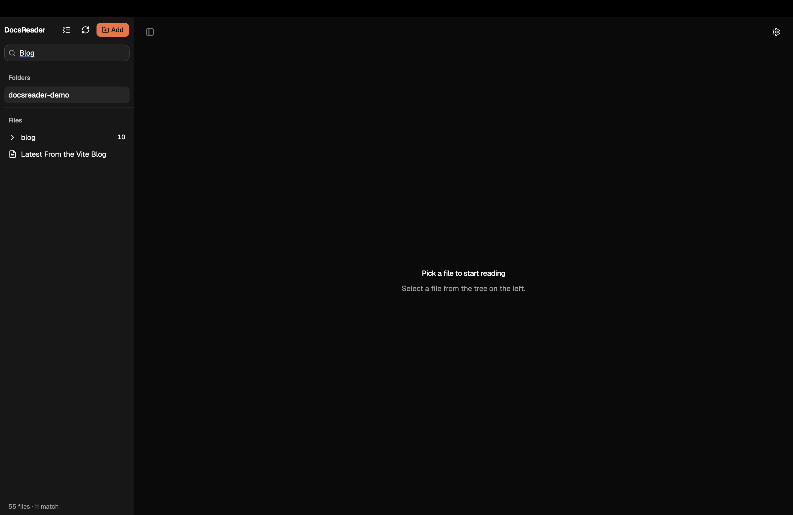 |
| 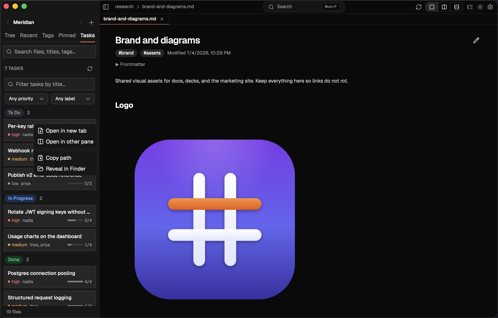 | 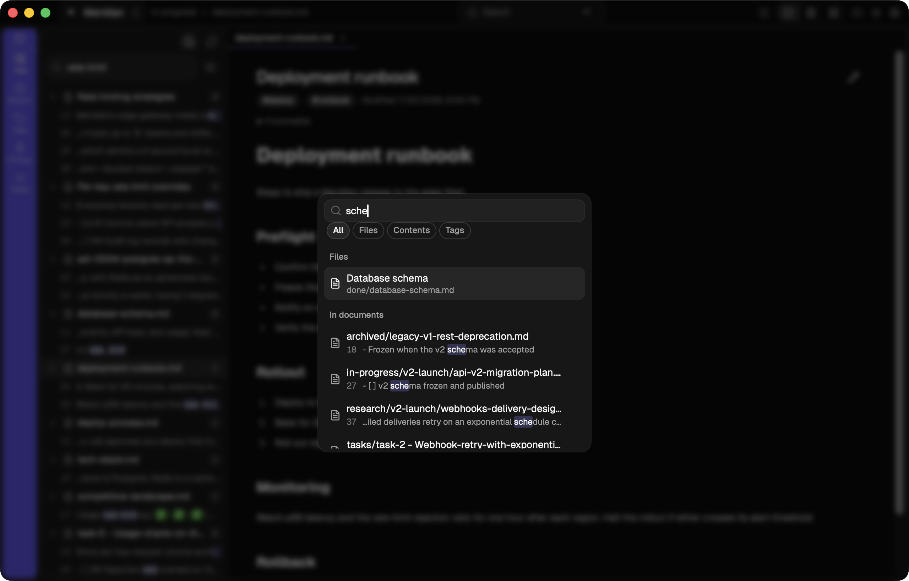 |
| 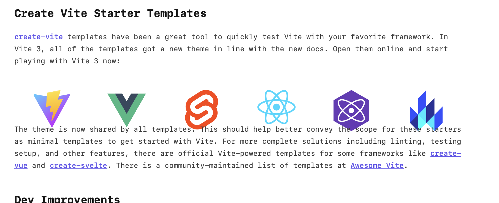 | 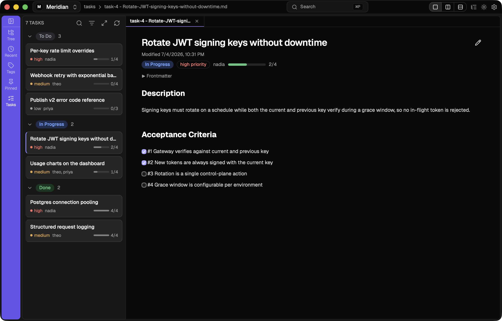 |
| 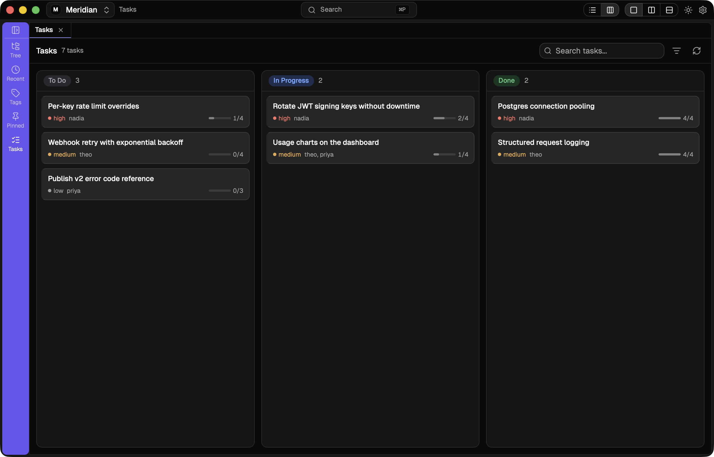 | 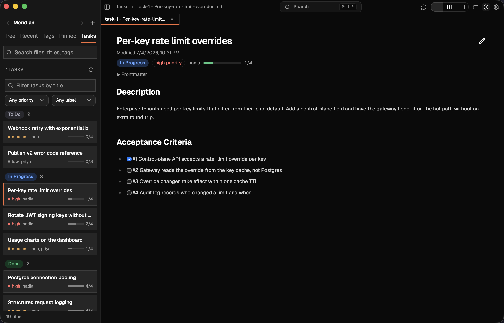 |
| 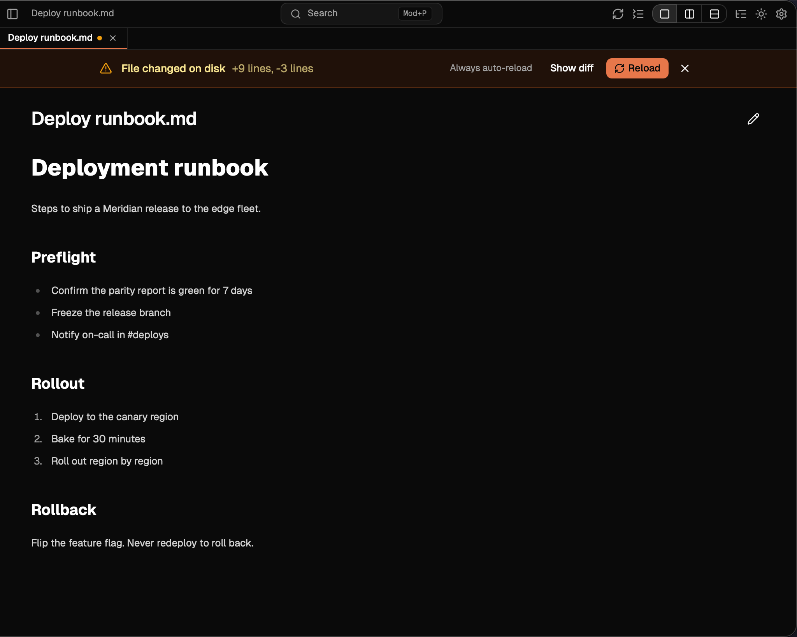 | 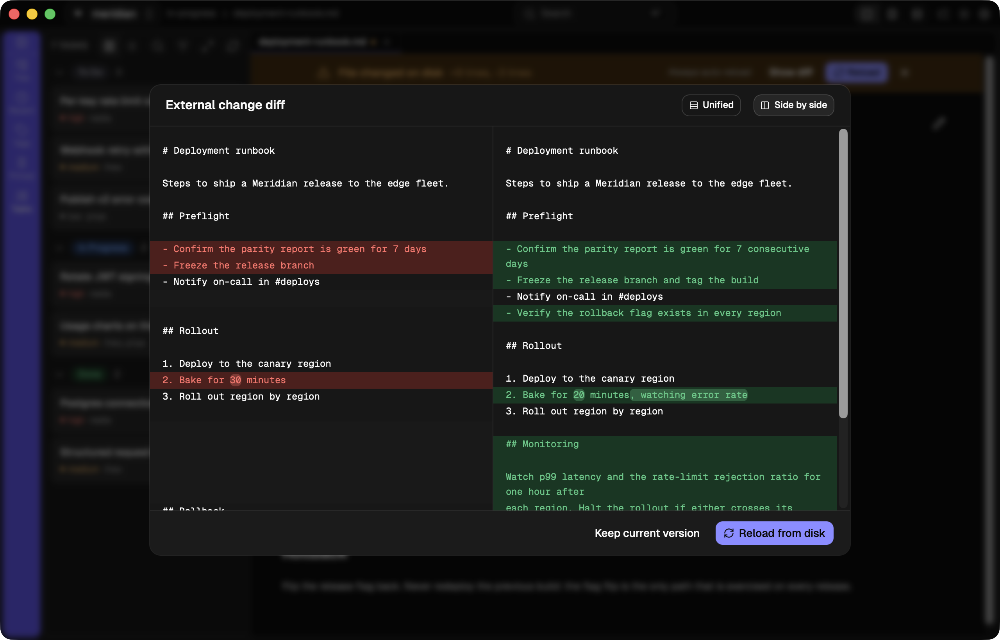 |

## Install

| Method | Command |
| --- | --- |
| macOS (Homebrew) | `brew install --cask anbturki/tap/docsreader` |
| macOS / Linux (curl) | `curl -fsSL https://raw.githubusercontent.com/anbturki/docsreader/main/install.sh \| bash` |
| Manual | Download from [Releases](https://github.com/anbturki/docsreader/releases/latest) (see below) |

Manual downloads: `DocsReader_*_universal.dmg` (macOS Intel + Apple Silicon), `DocsReader_*_amd64.AppImage` or `.deb` (Linux), `DocsReader_*_x64-setup.exe` (Windows).

## Security

See [SECURITY.md](./SECURITY.md).

---

## Development

Built with [Tauri 2](https://tauri.app/), React, and Rust. Requires [Bun](https://bun.sh/), [Rust](https://rustup.rs/), and the [Tauri 2 system deps](https://tauri.app/start/prerequisites/).

```sh
bun install
bun run tauri dev
```

The MCP server is a separate tauri-free binary in the same cargo workspace:

```sh
cargo build --manifest-path src-tauri/Cargo.toml -p docsreader-mcp
```

**Releasing:** GitHub → Actions → **Cut Release** → enter the version. The workflow bumps `tauri.conf.json` + `Cargo.toml` + `Cargo.lock`, commits, tags, and triggers the release pipeline (signs, notarizes the macOS bundle, drafts a GitHub Release, updates the Homebrew tap).
