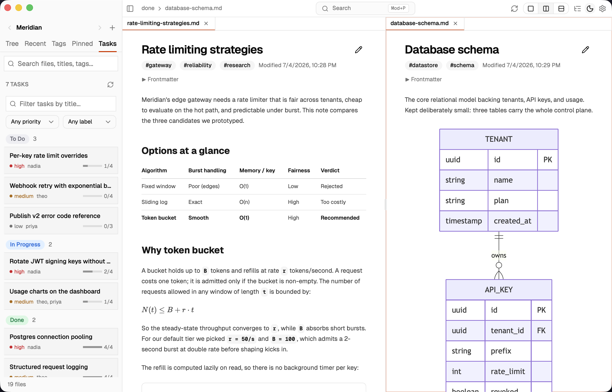

# DocsReader

Point it at any folder. DocsReader scans the directory for Markdown files, organizes them into a navigable tree, and renders each one in a clean reader. macOS, Linux, Windows.

[](https://github.com/anbturki/docsreader/releases/latest)
[](https://github.com/anbturki/docsreader/releases)
[](https://github.com/anbturki/docsreader/actions/workflows/notarize-staple.yml)
[](https://github.com/anbturki/docsreader/actions/workflows/notarize-staple.yml)

[](https://github.com/anbturki/docsreader/releases/latest/download/DocsReader_0.5.0_universal.dmg)
[](https://github.com/anbturki/docsreader/releases/latest/download/DocsReader_0.5.0_x64-setup.exe)
[](https://github.com/anbturki/docsreader/releases/latest/download/DocsReader_0.5.0_amd64.AppImage)

Linux: AppImage works on most distros - for `.deb` (Debian/Ubuntu) or `.rpm` (Fedora/RHEL), see [Releases](https://github.com/anbturki/docsreader/releases/latest).

Or install via [Homebrew or one-liner](#install).


## Features

**Reading**
- **Rendering:** GitHub-flavored Markdown via remark-gfm (tables, task lists, footnotes, autolinks, strikethrough)
- **Math expressions:** LaTeX rendered inline and in blocks via KaTeX
- **Diagrams:** Mermaid renderer (lazy-loaded, follows theme)
- **Box-drawing art:** svgbob converts ASCII diagrams to SVG (experimental)
- **Code blocks:** 20 bundled language grammars via Shiki, twelve highlighter palettes (5 light, 7 dark)
- **Appearance:** light, dark, or follow-system, with six accent hues
- **Type controls:** font family, body size, and reading column width

**Browsing**
- **Workspaces:** keep multiple unrelated folders open and pivot between them
- **Lenses:** four browsing modes over the same library (Tree, Recent, Tags, Pinned)
- **Jump-to-file:** fuzzy finder across every workspace, opens with Cmd+P (binding configurable)
- **Document outline:** auto-built TOC that follows the active heading as you scroll
- **Tabs:** many docs open at once; scroll position remembered per tab
- **Split view:** read two docs side-by-side or stacked; each pane keeps its own tabs, scroll, and external-change banner. Toggle from the header, drag the splitter to resize, or use Cmd+\ (horizontal), Cmd+Shift+\ (vertical), Cmd+1 / Cmd+2 to focus a pane. "Open in other pane" lives in the file context menu.
- **Search:** filename, path, frontmatter title, or tag
- **Sticky favorites:** pin individual files to the top of any workspace
- **Clutter rules:** glob patterns silently exclude files and folders from the explorer
- **External changes surfaced:** when a file you have open changes on disk (other editor, sync service, AI agent), a banner shows what changed with reload / keep / show-diff actions; configurable to silent reload

**Project-aware**

DocsReader stays "point it at any folder" by default. When a workspace happens to ship a `.docs.yaml` or live inside a git repo, extra signals light up automatically.

- **`.docs.yaml` manifests:** projects shipping a v0.1 manifest get curated navigation (hand-curated `items` and auto-listed `folder` sections with sort, title-from, badges, and nesting), project metadata in the workspace switcher, automatic homepage open on first add, cross-project links between open workspaces, ignore patterns, a visibility toggle for previewing public-only views, and a sidebar pane that surfaces manifest issues
- **Git status decorations:** in a git repo, the file tree shows per-file status badges (M / A / D / R / ? / U) that refresh as files change
- **Git diff vs HEAD:** right-click any tracked file to see the diff between HEAD and your working tree, with unified or side-by-side views and word-level highlighting

**Quiet by default**
- **Minimal chrome:** flat active states, no badges, only user-initiated motion (ADHD-friendly, low visual load)
- **One thing at a time:** lenses replace the tree instead of stacking on top of it
- **Same place, every launch:** controls do not migrate around the window
- **Resumes where you left off:** tabs, scroll, sidebar, and active lens persist across sessions

**Trust**
- **Stays local:** no telemetry, no sync; the only outbound request is the updater check
- **Signed updates:** every release artifact ships with a minisign signature; the updater verifies before applying
- **Gatekeeper-friendly:** code-signed and Apple-notarized on macOS
- **Hardened renderer:** strict CSP, sanitized HTML, scheme-allowlisted links

Found a bug, want a feature, or have feedback? [Open an issue](https://github.com/anbturki/docsreader/issues/new) - I'm actively building this and feedback shapes the roadmap.

## Roadmap

See [ROADMAP.md](./ROADMAP.md) for the full picture. Short version:

- **Next:** find-in-page, full-text search, focus mode, recognition for markdown task formats (Backlog.md, taskmd, generic frontmatter).
- **Later:** PDF export, kanban view over recognized task files, drag-a-folder-to-add-root, file management.
- **Considering:** plugin API, annotations, drag tabs between panes / N-pane nesting, local "smart" features (related-docs, TL;DR).

## Screenshots

| | |
|---|---|
|  |  |
|  |  |
|  |  |
|  |  |

## Install

### macOS (Homebrew)

```sh
brew install --cask anbturki/tap/docsreader
```

### macOS / Linux (curl)

```sh
curl -fsSL https://raw.githubusercontent.com/anbturki/docsreader/main/install.sh | bash
```

### Manual

From [Releases](https://github.com/anbturki/docsreader/releases/latest):

| OS | File |
|---|---|
| macOS (Intel + Apple Silicon) | `DocsReader_*_universal.dmg` |
| Linux | `docsreader_*_amd64.AppImage` or `.deb` |
| Windows | `DocsReader_*_x64-setup.exe` |

## Security

See [SECURITY.md](./SECURITY.md).

---

## Development

Built with [Tauri 2](https://tauri.app/), React, and Rust. Requires [Bun](https://bun.sh/), [Rust](https://rustup.rs/), and the [Tauri 2 system deps](https://tauri.app/start/prerequisites/) for your OS.

```sh
bun install
bun run tauri dev
```

### Releasing

GitHub → Actions → **Cut Release** → enter the version (e.g. `0.1.2`). The workflow bumps `tauri.conf.json` + `Cargo.toml` + `Cargo.lock`, commits, tags, and triggers the release pipeline (signs, notarizes the macOS bundle, drafts a GitHub Release, updates the Homebrew tap).
